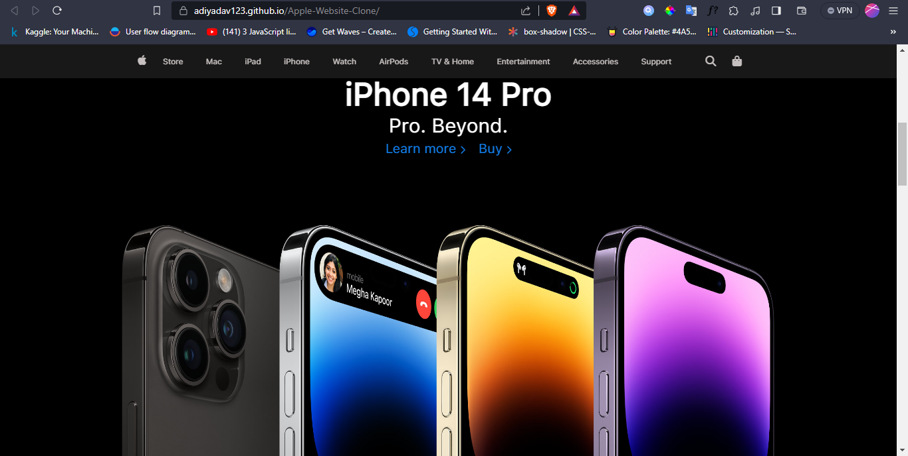

# Preview
> Link - https://bit.ly/Nitish_Apple_website_Git_Hub
 

Welcome to the Apple website repository! This project showcases a simple Apple website built using HTML and CSS.

My Name is Nitish kumar.

Here's how to run the project locally:

Clone the repository:

git clone https://github.com/nitishqr/Apple_Website/tree/main/Apple-Website-Clone-main

Navigate to the project directory:

Bash
cd Apple-Website-Clone-main
 
Open the index.html file:

Double-click the index.html file to open it directly in your default web browser.
OR, right-click the file and select "Open with" > "Choose another app"  to select your preferred browser.
That's it! You should now see the Apple website running in your browser.

## Additional Information

Technologies used: HTML, CSS

File structure:

index.html: Contains the main website content and structure.

style.css: Contains the website's styling.

Browser compatibility: Tested in modern web browsers (Chrome)

> Home Page

> iPhone 14 Pro Page

> iPhone 14 Page

> Easy To Switch Page

> Apple Watch & iPad Page

> AirPods & Trade Page

> Thank you 🍪
